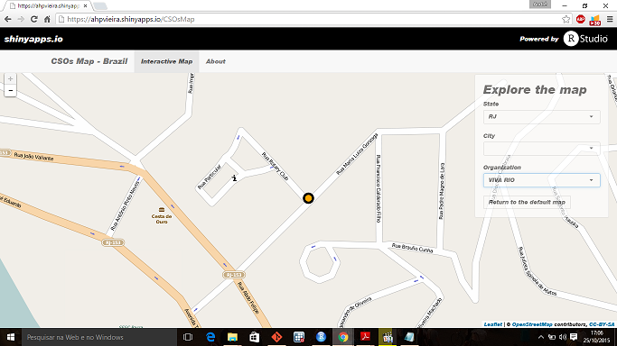

## The CSOs Map

* The CSOs Map presents some data on the civil society organizations (CSOs) in the state of Rio de Janeiro, Brazil.

* The data was extracted from databases produced by the Ministry of Labor and Employment and the Ministry of Planning, Budget and Management (MPOG) of Brazil.

* The app allows the user to find the civil society organizations with partnerships with the federal government in the state of Rio de Janeiro.

* The CSOs Map is still under development so its future releases should present new features.

* The code from the [Superzip example app](shiny.rstudio.com/gallery/superzip-example.html) was the major reference for this app.

--- .class #id 

## Why map civil society organizations?

Little is known about the civil society organizations in Brazil and the relationship between them and the Brazilian federal government. Still, the partnership between them are critical to the country's development.

The main mission of the Map is to provide data on civil organizations in Brazil and strengthen their rule in the Brazilian democracy.

The SCOs Map should become a reference tool for consultation on data relating to the civil society organizations in Brazil.

---

## How does the Map work

The app allows the user to choose the state, the city and/or the organization that interests him/her. In doing so, the map will automatically zoom in on the selected location or civil organization. The app code geolocates for the user any organization with partnerships with the federal government in the state of Rio de Janeiro.


```r
selectInput("listaOSC", label = "Organization", 
            choices = c("", levels(factor(coordrj$razao_social))), 
            selected = "")
```


```r
observeEvent(input$listaOSC, {
        coordrj <- subset(coordrj, coordrj$razao_social == input$listaOSC)
        if(nrow(coordrj)==0){
            leafletProxy("map")
        } else {
            leafletProxy(mapId = "map") %>% 
                setView(...) %>%
                addCircleMarkers(...)
        }
    })
```

---

## Exploring some functionalities

The figure below illustrates some of the functionalities the app presents in its present version.

-><-

